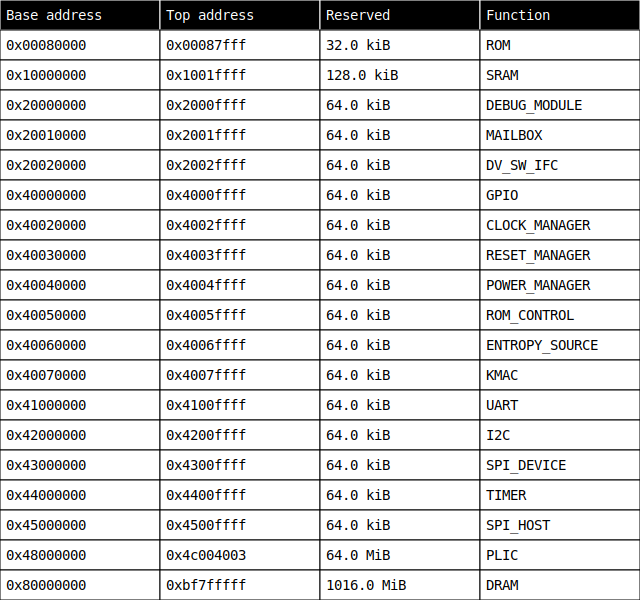

# Architecture

The Mocha architecture contains two crossbars.
One crossbar is 64-bit width and is meant for the main memory.
The other crossbar is uncached and meant to contain the peripherals.
Because most of these peripherals are imported from OpenTitan, in the first instance this bus is implemented as a TileLink Ultra-Lightweight bus with 32-bit width.

## Clock domains

There are three clock domains in Mocha.

1. Main: The main clock domain is the high-speed clock domain that runs the CVA6 core as well as the AXI crossbar it connects to, the AXI tag controller, debug module and the SRAM.
2. IO: The IO clock drives most of the peripherals and runs at a lower speed than the main clock.
   It drives the TileLink bus and most of the peripherals that are connected to it like the UART and the SPI device.
3. AON: The always on clock is also a low-speed clock with the difference being that it is always on.
   Both the main and IO clocks can be disabled and are turned off when a system reset is requested.
   The always on clock drives the clock, reset and power managers and allows the system to come out of reset.

## Memory map

This is the current memory map for Mocha, where the base and top addresses are inclusive, and reserved is the amount of memory reserved for this function:

## Top-level interface

The Mocha top will need a few top-level inputs.
Some of these are listed here:
- Clock outputs from PLLs.
- Rollback counter backed by OTP.
- Debug and design for test enable pins.
- True random noise source to drive the entropy source.
- AXI subordinate port to connect to the mailbox.

In terms of output, the top-level will need output signals:
- Key to provide an AES engine outside of the secure enclave with the memory encryption key.
- AXI manager port to interact with the rest of the chip.

## SRAM specification

The static random-access memory (SRAM) in CHERI Mocha is mainly used as the stack and heap for the boot firmware that lives in the read-only memory (ROM).
However, it should also be possible to execute from SRAM.
Once code starts executing from dynamic random-access memory (DRAM), we don't envision using SRAM anymore.

The SRAM block has four ports:
- Clock input
- Reset input
- AXI4 request input from the main SoC sub-system crossbar
- AXI4 response output back to the main crossbar

Inside the block it translates the AXI4 requests into an SRAM interface that our primitive RAM wrappers use.
It needs to support AXI4 protocol including:
- Bursts, where the last signal must be indicated correctly.
- Response must have the same AXI4 ID as the request
- Atomic support is *excluded*.
- The data width is 64 bits.
- The address range and size of the SRAM are defined in the [memory map](#memory-map). Accesses outside this range must return an error, including if only part of the burst is outside the memory range.
- Responses must return within a bounded amount of time that may be proportional to the length of the burst.
- Only aligned 64-bit accesses are allowed.

There needs to be 1 CHERI tag bit per 128-bit aligned region.
A tag should only be set to 1 by writing a full 128-bit aligned region.
This 128-bit aligned transaction must be part of a single burst.
The CHERI tag bits are communicated through a single user bit per AXI4 flit (`wuser` and `ruser` for writes and reads respectively).
There should be an assertion to notify when writes occur where `wuser` is set to 1 which is not part of a full capability write.
There should also be an assertion for `wuser` mismatches, where one part of the capability is marked as valid while another is invalid in the same transaction.
If a portion of the 128-bit aligned region is written it must clear the tag for the whole region including when a partial write strobe is used.

Reads that only read part of a 64-bit value are allowed from valid capability regions, but these should have their tag cleared.
Burst reads from the SRAM must have the appropriate CHERI tags set for each address, so a valid capability must have the user bits set for both of the 64-bit flits it is being sent back, and a mixture of capability and non-capability data is allowed in a burst.
The SRAM is allowed to mark a capability as invalid by setting one or both of the `ruser` bits to zero, so the core must AND the two `ruser` values together to determine the validity of a capability.
Tags should be stored in a separate block of memory from the data, this is to allow future optimisations where bulk-reads of tags are desired.

The initial value of the SRAM including the tags is undefined at start-up.
